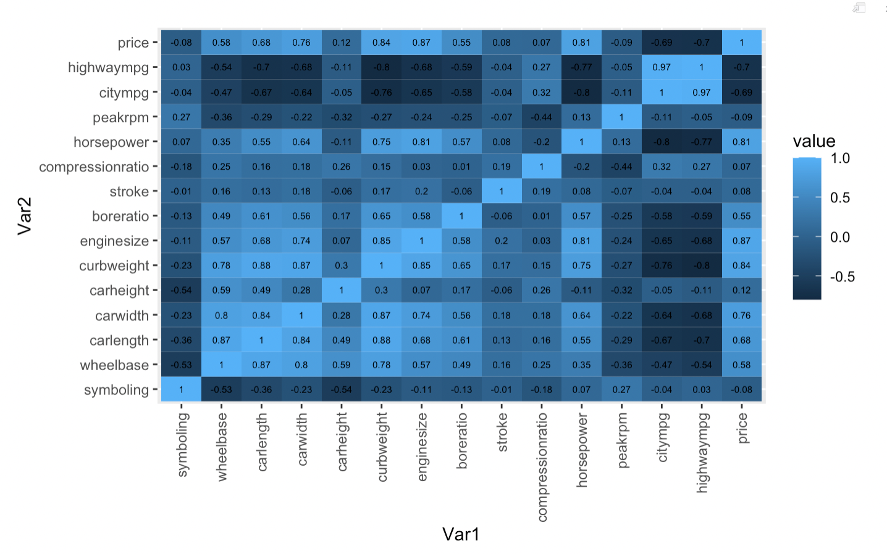

### Data Source

*Automobile Data Set* from UCI Machine Learning Repository (DIM: 26 x 205)

### Outcome and Variable used in analyses

The dependent variable is car price, the car price distribution is as followed:

| Mean   | 25 percentile | Median  | 75 percentile | Maximum |
|--------|---------------|---------|---------------|---------|
| \$5118 | \$7788        | \$10295 | \$16503       | \$45400 |

The covariates used in the study are:

| Variable name    | Description                                                                                                                          |
|------------------------------------|------------------------------------|
| symbolling       | Its assigned insurance risk rating, A value of +3 indicates that the auto is risky, -3 that it is probably pretty safe.(Categorical) |
| wheelbase        | Weelbase of car (Numeric)                                                                                                            |
| carlength        | Length of car (Numeric)                                                                                                              |
| carwidth         | Width of car (Numeric)                                                                                                               |
| carheight        | height of car (Numeric)                                                                                                              |
| curbweight       | The weight of a car without occupants or baggage. (Numeric)                                                                          |
| enginesize       | Size of car (Numeric)                                                                                                                |
| boreratio        | Boreratio of car (Numeric)                                                                                                           |
| stroke           | Stroke or volume inside the engine (Numeric)                                                                                         |
| compressionratio | compression ratio of car (Numeric)                                                                                                   |
| horsepower       | Horsepower (Numeric)                                                                                                                 |
| peakrpm          | car peak rpm (Numeric)                                                                                                               |
| citympg          | Mileage in city (Numeric)                                                                                                            |
| highwaympg       | Mileage on highway (Numeric)                                                                                                         |

### Missing Value

There is no missing value in the dataset

### Correlation Analysis

It is noticed that among numeric variables:

-   wheelbase has positive correlation with price of 58%.
-   car length and car width have positive correlation with price of 68% and 76%.
-   curbweight has positive correlation with price of 84%.
-   enginesize has positive correlation with price of 87%.
-   boreratio has positive correlation with price of 55%.
-   horsepower has positive correlation with price of 81%.
-   citympg and highwaympg have negative correlation with price of 69% and 70%.

### Goal

-   Find powerful predictors of car price
-   Construct accurate prediction models for car price
-   Compare model performance
