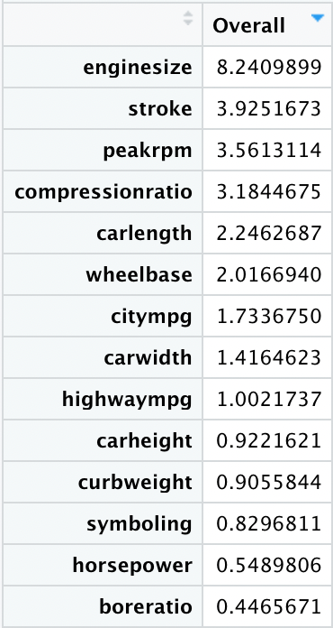
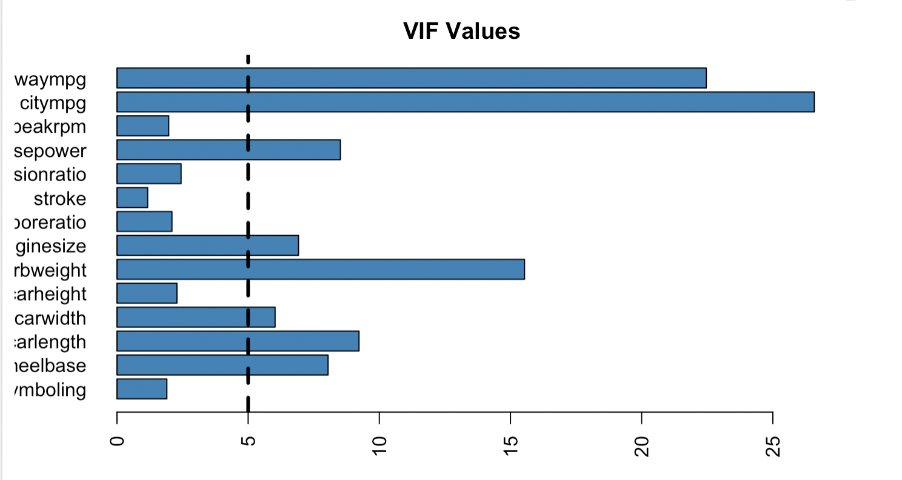
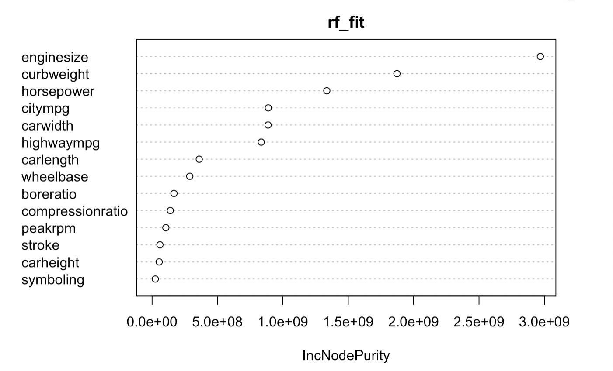
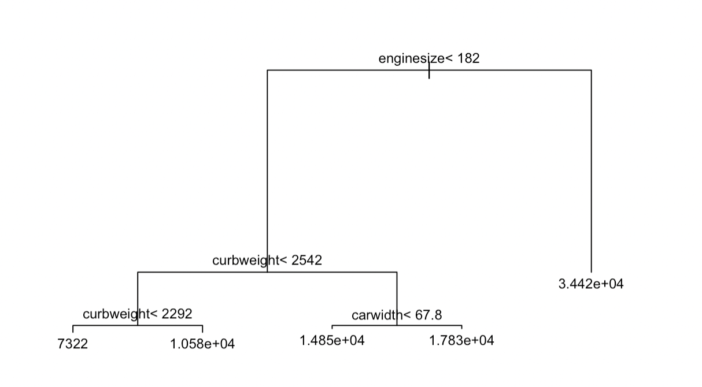

### Linear Regression

Based on model summary and variable importance:

-   Six covariates are statistically significant at 0.05 significance level
-   Three variables have negative impact on the car price
-   Eleven variables have positive impact on the car price
-   Enginesize is the leading predictor for car price

Multicollinearity was checked by performing Variance Inflation Factor (VIF). Among fourteen VIF values, eight values are larger than 5, which means that eight variable exhibits correlation with other variables in the dataset.

The calculated R-square are:

|              | R-square |
|--------------|----------|
| Training set | 0.8462   |
| Testing set  | 0.8143   |

### LASSO Regression

*10-fold Cross Validation model* shows minimum lambda is 31.73. 

Using the most optimal lambda as the parameter for LASSO regression, a model was fitted. The calculated R-square are:

|              | R-square |
|--------------|----------|
| Training set | 0.8577   |
| Testing set  | 0.8065   |

It is noticed that the difference between R-square on testing set and training set is larger than that of linear regression. This indicates that LASSO regression model may lack generalizability and exhibit more overfitting issue compared to the linear regression model.

### Random Forest

A Random Forest model was fitted on the dataset. Based on the plot below, as the number of trees increases to 100, the error decreases and tends to be stable.

The calculated R-square are:

|              | R-square |
|--------------|----------|
| Training set | 0.9226   |
| Testing set  | 0.9333   |

There is no big difference between the R-square on training set and R-square on testing set. The small difference indicates there is no over-fitting issue on random forest model.

Based on the IncNodePurity values, enginesize, curbweight, and horsepower are the most significant variables for the Random Forest model.

### Regression Tree

A regression tree was fitted to see whether better performance could be obtained. Here is the visualization of Regression tree: 

Based on the plot, first split occurred based on enginesize. The second split occurred based on curbweight. And the third split occurred based on curbweight and carwidth. The splits indicate that the most significant predictors in regression trees are enginesize, curbweight, and carwidth.

The calculated R-square are:

|              | R-square |
|--------------|----------|
| Training set | 0.90     |
| Testing set  | 0.84     |

The difference is not very large, which indicated there is no dramatic overfitting issues.

### Model Comparison

-   Random Forest model has the largest R-square, which indicates that Random Forest model has the best performance among all models.
-   Random Forest model has the smallest difference in R-square between training set and testing set. The small R-square difference shows that Random Forest model has the best generalizability.
-   Parametric methods have lower R-square than non-parametric methods.

